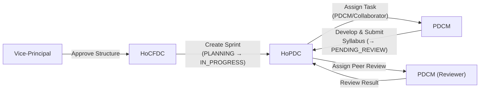

# Phân Tích Nhu Cầu Real-Time Theo Từng Role (v2 — Đã Chỉnh Sửa)

> [!NOTE]
> Phiên bản này đã được cập nhật dựa trên luồng thực tế của HoPDC do user cung cấp, khác biệt so với phiên bản cũ ở phần HoPDC workflow.

---

## Tổng Quan Luồng Chính Của Hệ Thống



---

## 1. Vice-Principal (Phó Hiệu Trưởng)

### Workflow thực tế
- Approve/reject curriculum structure từ HoCFDC
- Chuyển PLO status sang `INTERNAL_REVIEW`
- Digital enactment (Sign → Publish)

### ❌ Không cần real-time
- **Lý do**: VP là người **khởi xướng hành động**, không phải người **chờ đợi**. VP tự quyết định khi nào mở giao diện review. HoCFDC phải chủ động submit trước.
- **Giải pháp thay thế**: `refetchOnWindowFocus` + manual refresh là đủ.

### ✅ Nice-to-have (P3)
| Topic | Mục đích | Thay thế |
|-------|----------|----------|
| `/topic/event/curriculum/{id}` | Biết khi HoCFDC submit curriculum lên để review | Badge "New" trên sidebar, polling mỗi 5 phút |

---

## 2. HoCFDC (Trưởng Khoa Phát Triển Chương Trình)

### Workflow thực tế
- Tạo/quản lý curriculum structure (subjects, semesters, PO-PLO mapping)
- Tạo sprint (`PLANNING`) → chuyển sprint sang `IN_PROGRESS` (gửi cho HoPDC)
- Submit curriculum structure lên VP review
- Theo dõi tổng thể tiến độ sprint

### ⚠️ Có 1 điểm nên có real-time (P2)

| Scenario | Vấn đề nếu không có real-time | Mức độ |
|----------|-------------------------------|--------|
| **VP approve/reject curriculum** | HoCFDC submit curriculum lên VP, nhưng **không biết khi nào VP phản hồi**. Phải F5 thủ công. Tuy nhiên, đây là hành động **hiếm khi xảy ra** (1 curriculum = 1 lần review) → ảnh hưởng thấp. | **P2** |

### Topic phù hợp
```
/topic/event/curriculum/{curriculumId}
```

---

## 3. HoPDC (Trưởng Khoa Phát Triển Đề Cương) — ⭐ CẦN REAL-TIME

### Screen flow chính (đã chỉnh lại)

| # | Giao diện | Mô tả |
|---|-----------|-------|
| 1 | `/dashboard/hopdc/sprint-management` | Nhận sprint thuộc department (từ HoCFDC khi chuyển `PLANNING → IN_PROGRESS`). Hiện danh sách sprint `IN_PROGRESS`. Bấm **Manage Task** để vào xem chi tiết. |
| 2 | `/dashboard/hopdc/assignments?sprintId=&curriculumId=` | Quản lý task của sprint. HoPDC assign PDCM/Collaborator cho `NEW_SUBJECT`, hoặc tự handle `REUSED_SUBJECT` (Mark as Done). |
| 3 | `/dashboard/hopdc/sprint-management/new-subject?subjectId=&curriculumId=&sprintId=` | Chi tiết subject: **Tab Subject Detail** (xem thông tin môn), **Tab Subject Mapping** (tạo CLO, map CLO-PLO), **Tab Syllabus** (xem tiến độ syllabus). |

> [!IMPORTANT]
> Giao diện `/dashboard/hopdc/review-workflow` và `/dashboard/hopdc/reviews/[syllabusId]` tồn tại trong code nhưng **chưa phải luồng chính đang sử dụng**. Phân tích real-time dưới đây tập trung vào 3 screen flow chính ở trên.

### 🔴 CẦN REAL-TIME THỰC SỰ

| # | Scenario | Tại sao không polling được? | Topic |
|---|----------|-----------------------------|-------|
| 1 | **HoCFDC chuyển sprint sang IN_PROGRESS** (sprint mới xuất hiện) | HoPDC đang ở trang sprint-management. Khi HoCFDC chuyển sprint status, **sprint mới không tự xuất hiện** trong danh sách trừ khi HoPDC F5. Nếu HoPDC không biết có sprint mới → **delay cả quy trình assign task**. Polling mỗi 30s tuy hoạt động nhưng gây delay đáng kể khi sprint cần xử lý gấp. | `/topic/notification/department/{deptId}` hoặc `/topic/notification/account/{accountId}` |
| 2 | **PDCM hoàn thành develop syllabus** (chuyển syllabus → PENDING_REVIEW) | HoPDC đang ở trang assignments hoặc tab Syllabus trong new-subject. PDCM submit syllabus nhưng **HoPDC không biết**. Tab Syllabus vẫn hiện status cũ. HoPDC phải kiểm tra thủ công từng task. Khi quản lý 10-20 tasks → **bất khả thi theo dõi thủ công**. | `/topic/notification/account/{accountId}` |
| 3 | **PDCM peer-reviewer trả kết quả review** (task → DONE / REJECTED) | HoPDC đã assign peer-review. Reviewer submit kết quả nhưng HoPDC **không có cách nào biết ngay** trừ khi vào từng task expand xem. Đây là bottleneck trong quy trình aggregate kết quả review. | `/topic/event/task/{taskId}` |

---

## 4. PDCM (Thành Viên Phát Triển Đề Cương)

### Workflow thực tế
- Nhận task develop syllabus từ HoPDC (TO_DO → IN_PROGRESS)
- Develop syllabus: tạo sessions, assessments, materials
- Submit syllabus → PENDING_REVIEW (gửi lên HoPDC)
- Nhận peer-review assignment
- Review syllabus đồng nghiệp → submit kết quả

### 🔴 CẦN REAL-TIME THỰC SỰ

| # | Scenario | Tại sao không polling được? | Topic |
|---|----------|-----------------------------|-------|
| 4 | **HoPDC assign task mới / peer-review** | PDCM đang develop syllabus ở `/dashboard/pdcm/tasks/[taskId]/...`. HoPDC assign thêm task hoặc peer-review. **PDCM không biết có việc mới** cho đến khi tự vào trang chính kiểm tra. Nếu deadline ngắn → trễ deadline vì không nhận thông tin. | `/topic/notification/account/{accountId}` |
| 5 | **HoPDC approve/reject syllabus sau review** | PDCM submit syllabus rồi chờ. **Không biết khi nào reviewer xong** → không biết nên chờ hay bắt đầu revision. Vòng lặp feedback quan trọng nhất. | `/topic/notification/account/{accountId}` |

> [!WARNING]
> Scenario 4 và 5 **không thể giải quyết hiệu quả bằng polling**. PDCM đang tập trung develop syllabus ở tab khác, không có lý do F5 trang tasks. Push notification là giải pháp duy nhất.

---

## 5. Collaborator

### Workflow thực tế
- Chỉ có trang profile, có thể nhận task develop syllabus tương tự PDCM.

### ❌ Chưa cần real-time
- **Lý do**: Luồng chưa rõ ràng. Nếu sau này Collaborator có cùng workflow với PDCM → áp dụng tương tự.

---

## Tổng Kết: 5 Scenarios Thực Sự Cần Real-Time

| Priority | Scenario | Trigger | Ai cần biết | Topic đề xuất |
|----------|----------|---------|-------------|---------------|
| **P0** | Sprint mới được activate (PLANNING→IN_PROGRESS) | HoCFDC → | **HoPDC** | `/topic/notification/account/{accountId}` |
| **P0** | PDCM submit syllabus (→PENDING_REVIEW) | PDCM → | **HoPDC** | `/topic/notification/account/{accountId}` |
| **P0** | Peer-reviewer trả kết quả | PDCM → | **HoPDC** | `/topic/event/task/{taskId}` |
| **P0** | Task mới được assign | HoPDC → | **PDCM** | `/topic/notification/account/{accountId}` |
| **P0** | Syllabus review result (approve/reject) | HoPDC → | **PDCM** | `/topic/notification/account/{accountId}` |
| P2 | VP approve curriculum | VP → | HoCFDC | `/topic/event/curriculum/{id}` |

---

## Đề Xuất Implementation Theo Giai Đoạn

### Phase 1 — Core (Bắt buộc, cover 4/5 P0 scenarios)
Subscribe **2 topic** sau khi login:

```
/topic/notification/account/{accountId}     ← notification cá nhân
/topic/notification/broadcast/system         ← toàn hệ thống
```

Kết hợp REST API:
```
GET /api/notifications/unread-count          ← badge number
GET /api/notifications/my-notifications      ← snapshot ban đầu
```

> [!TIP]
> Chỉ 2 topic này đã cover: Sprint mới (scenario 1), Syllabus submitted (scenario 2), Task assigned (scenario 4), Review result (scenario 5). Tất cả đều thông qua **notification cá nhân** mà backend gửi khi có status change.

### Phase 2 — Context-aware (Cover remaining P0)
Subscribe thêm khi user **đang ở màn hình cụ thể**:

```
// HoPDC đang ở /assignments → theo dõi từng task đang expand
/topic/event/task/{taskId}

// HoPDC đang ở tab Syllabus của new-subject
/topic/event/syllabus/{syllabusId}
```

Unsubscribe khi rời màn hình → tiết kiệm tài nguyên.

### Phase 3 — Nice-to-have
```
// HoCFDC chờ VP approve curriculum
/topic/event/curriculum/{curriculumId}

// Department-wide announcements
/topic/notification/department/{departmentId}
```

---

## Những Topic Backend Đã Thiết Kế Nhưng CHƯA CẦN

| Topic | Lý do chưa cần |
|-------|----------------|
| `/topic/notification/syllabus/{syllabusId}` | Syllabus editor là single-user, không cần collab real-time |
| `/topic/notification/review/{reviewId}` | Review là sequential, 1 reviewer xong → submit, không cần live update giữa chừng |
| `/topic/status/{resourceType}/{resourceId}` | Đã được cover bởi event topics + notification |
| `/topic/status/system/health` | Chỉ cần cho admin monitoring, không cho end-user |
| `/topic/notification/broadcast/department/{deptId}` | Announcement không urgent, REST notification list đủ |

> [!NOTE]
> Các topic trên không phải sai thiết kế — chúng hữu ích nếu dự án scale (collaborative editing, real-time dashboard). Nhưng với **flow hiện tại**, chúng không giải quyết vấn đề nào mà Phase 1 + Phase 2 chưa cover.

---

## So Sánh Với Phiên Bản Cũ

| Thay đổi | v1 (cũ) | v2 (mới) |
|----------|---------|----------|
| HoPDC workflow chính | Review syllabus pending (review-workflow) | Sprint management → Assignments → Subject Detail |
| HoPDC real-time trigger | PDCM submit → HoPDC review queue | Sprint activate + PDCM submit + Peer-review result |
| Thêm scenario mới | — | Sprint PLANNING→IN_PROGRESS (HoCFDC → HoPDC) |
| Review workflow | Luồng chính | Tồn tại nhưng chưa dùng, loại khỏi phân tích chính |
